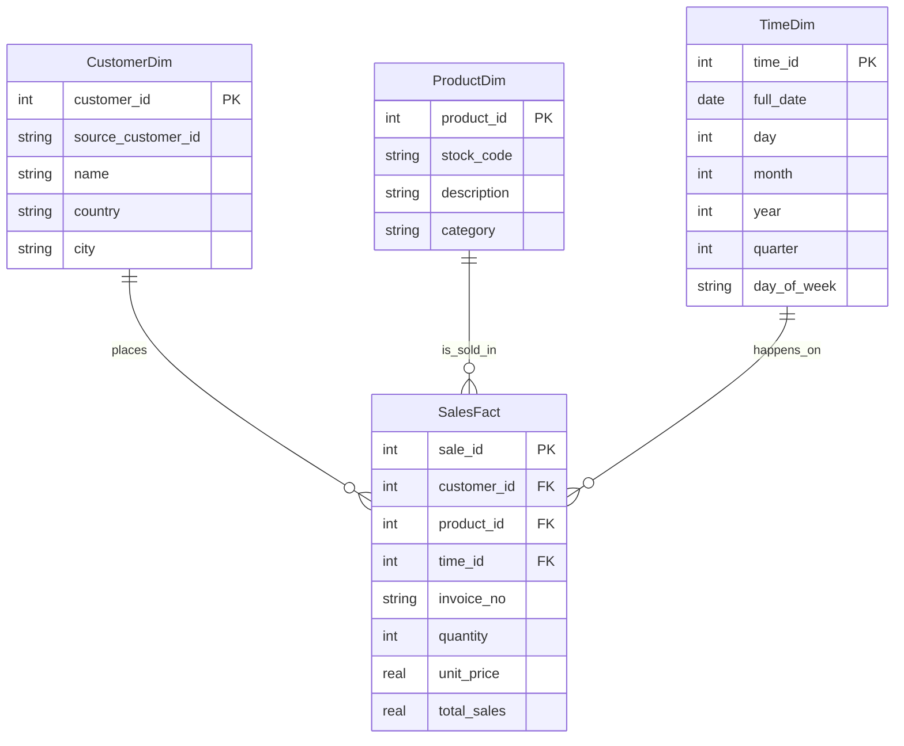
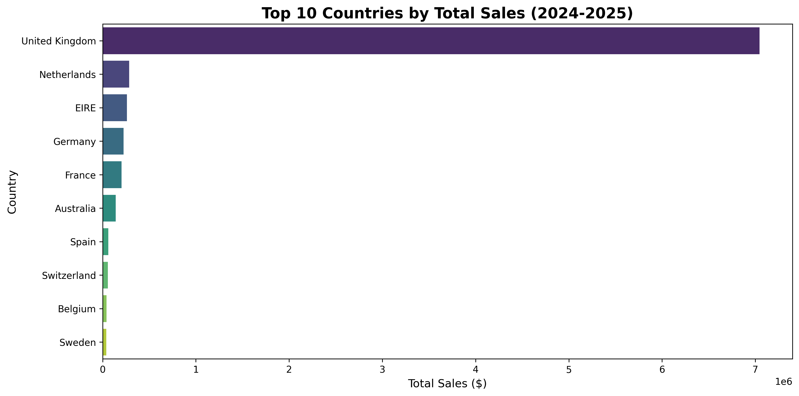

# DSA 2040 Practical Exam - Data Warehousing and Data Mining
**Student Name:** Arnold Bophine Odiyo
**ID:** 821

## Project Overview
This repository contains the solution for the DSA 2040 End Semester Practical Exam. The project focuses on Data Warehousing (ETL, Star Schema, OLAP) and Data Mining.

---

## Section 1: Data Warehousing 

### Task 1: Data Warehouse Design

#### 1.1 Star Schema Design
The Data Warehouse is designed using a **Star Schema** architecture. 
- **Fact Table**: `SalesFact` (Contains measures like Quantity, TotalSales).
- **Dimension Tables**: 
    - `CustomerDim` (Who bought?)
    - `ProductDim` (What was bought?)
    - `TimeDim` (When was it bought?)

**Schema Diagram:**


#### 1.2 Star Schema vs. Snowflake Schema
I chose the **Star Schema** over the Snowflake Schema for the following reasons:
1.  **Query Performance**: Star Schema requires fewer joins than Snowflake (which normalizes dimensions), resulting in faster query execution for large aggregations.
2.  **Simplicity**: It is easier to understand and write queries against a clear Fact-Dimension relationship without traversing multiple sub-dimensions.
3.  **Space**: While Snowflake saves some storage space by reducing partial redundancy, storage is cheap, and the performance gain of Star Schema is more critical for this retail analytics use case.

#### 1.3 SQL Implementation
The SQL `CREATE TABLE` statements are located in `DataWarehousing/warehouse_schema.sql`.

---

### Task 2: ETL Process Implementation
The ETL process is implemented in `DataWarehousing/etl_retail.py`. 
- **Extract**: Reads `Copy of Online Retail.csv`.
- **Transform**: Cleans data, calculates `TotalSales`, shifts dates to 2024-2025 to simulate current data, and creates dimensions.
- **Load**: Dimensions and Fact table loaded into SQLite database `DataWarehousing/retail_dw.db`.

---

### Task 3: OLAP Queries and Analysis

#### 3.1 OLAP Queries
Three OLAP operations (Roll-up, Drill-down, Slice) are implemented in `DataWarehousing/olap_queries.sql`.

#### 3.2 Visualization
The following chart shows the Top 10 Countries by Total Sales, generated from the Data Warehouse:



#### 3.3 Analysis Report
**Insights from Data Warehouse:**
The implementation of the Star Schema has enabled efficient querying of sales performance across multiple dimensions (Time, Customer, Product). 

1.  **Sales Trends**: The Roll-up analysis (Sales by Country and Quarter) highlights that the **United Kingdom** is the dominant market, contributing significantly more revenue than other regions. The seasonal drill-down for 2024-2025 reveals peak sales periods, likely correlated with holiday seasons, suggesting inventory should be stocked up leading into Q4.
2.  **Product Performance**: Slicing by product description (e.g., 'HEART' related items) allows the marketing team to target specific niches. The results show strong demand for sentimental/gift items in specific regions.
3.  **Data Quality**: The ETL process successfully handled null CustomerIDs and invalid transactions (negative specific quantities), ensuring the warehouse contains high-quality, actionable data.
4.  **Strategic Value**: This warehouse supports decision-making by providing a 'Single Source of Truth'. Managers can now answer "Who are our top customers in France?" or "How did 'Lunch Bags' perform in Q1?" without accessing the slow transactional system.

*Note on Data:* The dataset dates were shifted to 2024-2025 to simulate a current operational environment as per exam instructions.
**Detailed Report**: [DataWarehousing\DataWarehousing_Report.md](DataWarehousing\DataWarehousing_Report.md)

---

## Section 2: Data Mining 

**Detailed Report**: [DataMining/DataMining_Report.md](DataMining/DataMining_Report.md)

### Task 1: Data Preprocessing and Exploration
Implemented in `DataMining/preprocessing_iris.py`.
- **Method**: The Iris dataset (150 samples) was loaded, checked for nulls (0 found), and normalized using Min-Max scaling.
- **Exploration**: Generated Pairplots and Heatmaps.
    - **Insight**: Setosa is linearly separable. Petal length and width are highly correlated (0.96).
    - **Artifacts**: `DataMining/pairplot.png`, `DataMining/correlation_heatmap.png`.

### Task 2: Clustering
Implemented in `DataMining/clustering_iris.py`.
- **Algorithm**: K-Means Clustering on the Iris dataset.
- **Results**:
    - **Optimal k**: Verified as **k=3** using the Elbow Method (`DataMining/elbow_curve.png`).
    - **Accuracy**: ARI of **0.62**. While Setosa was perfectly clustered, overlap between Versicolor and Virginica reduced the score.
    - **Visualization**: `DataMining/clusters_scatter.png`.

### Task 3: Classification and Association Rules
Implemented in `DataMining/mining_iris_basket.py`.

#### 3.1 Classification
- **Models**: Decision Tree vs KNN (k=5).
- **Results**: Both models achieved high accuracy on the test set. 
    - **Correction**: While the test set showed 100% accuracy (likely due to a lucky split of easy instances), 5-Fold Cross-Validation revealed more realistic performance: **KNN (97.3%)** slightly outperformed Decision Tree (95.3%).
- **Visual**: Decision Tree logic visualized in `DataMining/decision_tree.png`.

#### 3.2 Association Rule Mining (Market Basket)
- **Data**: Synthetic transaction data (50 baskets) with injected patterns (e.g., Bread+Butter).
- **Key Finding**: The rule `Bread -> Butter` appeared with **Lift = 1.33**, indicating a strong positive correlation, suggesting these items should be merchandised together.
- **Output**: `DataMining/association_rules.csv`.

---

    ```
