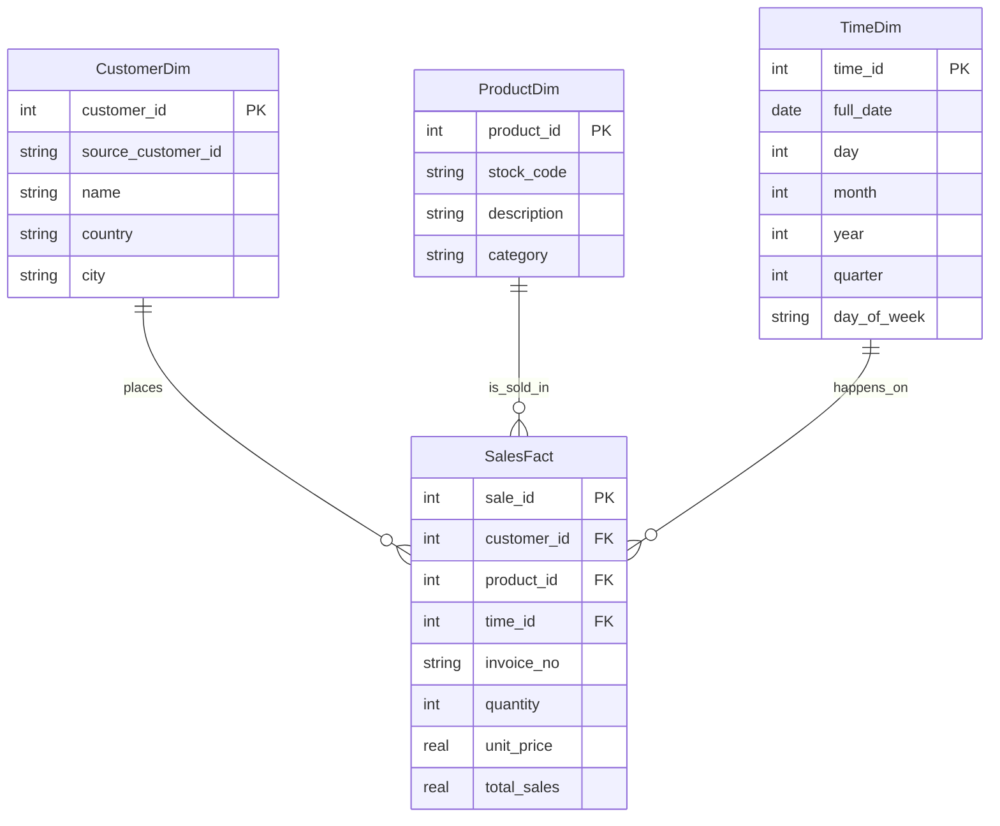

# DSA 2040 Practical Exam - Data Warehousing and Data Mining
**Student Name:** Arnold Bophine Odiyo
**ID:** 821

## Project Overview
This repository contains the solution for the DSA 2040 End Semester Practical Exam. The project focuses on Data Warehousing (ETL, Star Schema, OLAP) and Data Mining.

---

## Section 1: Data Warehousing (50 Marks)

### Task 1: Data Warehouse Design

#### 1.1 Star Schema Design
The Data Warehouse is designed using a **Star Schema** architecture. 
- **Fact Table**: `SalesFact` (Contains measures like Quantity, TotalSales).
- **Dimension Tables**: 
    - `CustomerDim` (Who bought?)
    - `ProductDim` (What was bought?)
    - `TimeDim` (When was it bought?)

**Schema Diagram:**

#### 1.2 Star Schema vs. Snowflake Schema
I chose the **Star Schema** over the Snowflake Schema for the following reasons:
1.  **Query Performance**: Star Schema requires fewer joins than Snowflake (which normalizes dimensions), resulting in faster query execution for large aggregations.
2.  **Simplicity**: It is easier to understand and write queries against a clear Fact-Dimension relationship without traversing multiple sub-dimensions.
3.  **Space**: While Snowflake saves some storage space by reducing partial redundancy, storage is cheap, and the performance gain of Star Schema is more critical for this retail analytics use case.

#### 1.3 SQL Implementation
The SQL `CREATE TABLE` statements are located in `DataWarehousing/warehouse_schema.sql`.

---
